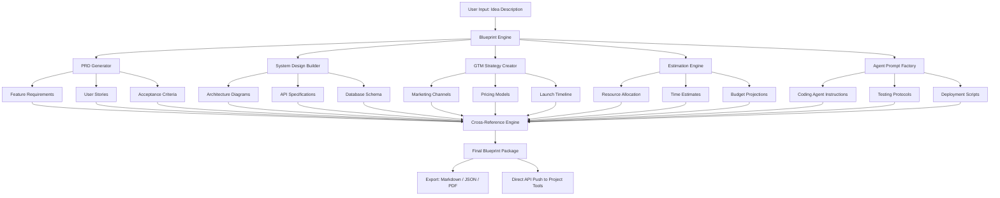

# Product Launch Blueprint AI: From Concept to Market in Days

[](https://zaahist.github.io/design-to-ship-playbook/)

## What If Your Product Ideas Could Fly Before They Had Wings?

Every revolutionary product begins as a whisper—a half-formed notion that keeps you awake at 3 AM. But the journey from that whisper to a market-ready launch is littered with abandoned prototypes, misaligned teams, and feature creep that buries the original vision. **Product Launch Blueprint AI** is not another project management tool. It is a strategic co-pilot that transforms your raw concept into a battle-ready blueprint, complete with architectural diagrams, go-to-market maneuvers, technical estimates, and AI-agent prompts that your coding teams can execute immediately.

Think of it as the difference between trying to build a skyscraper with a hammer and nails versus having a complete set of blueprints, material estimates, construction schedules, and a foreman who speaks every trade's language. This repository gives you that foreman—in code form.

---

## Table of Contents

- [What Makes This Different?](#what-makes-this-different)
- [Architecture Overview](#architecture-overview)
- [Quick Start Guide](#quick-start-guide)
  - [Example Profile Configuration](#example-profile-configuration)
  - [Example Console Invocation](#example-console-invocation)
- [Core Capabilities](#core-capabilities)
- [AI Integration Layer](#ai-integration-layer)
- [Compatibility & Environment](#compatibility--environment)
- [Feature Matrix](#feature-matrix)
- [Use Cases That Matter](#use-cases-that-matter)
- [License & Legal](#license--legal)
- [Disclaimer](#disclaimer)

---

## What Makes This Different?

Most AI development tools are like giving a writer a typewriter that only types the letter "A." **Product Launch Blueprint AI** speaks the language of product managers, engineers, marketers, and C-suite executives simultaneously. It doesn't just generate text—it generates **structure**.

Consider a standard PRD: a document that sits in a folder, collecting digital dust. Our blueprint generator creates living documents that connect directly to system architecture diagrams, timeline estimates, risk matrices, and even the exact prompts your engineering team should feed into their coding assistants. The PRD doesn't just describe what to build—it contains the seeds of how to build it, when to launch it, and what to charge for it.

The system operates on a simple but powerful premise: **every great product is a system of systems**. Your database schema informs your API design, which constrains your user interface, which shapes your marketing copy. Our AI understands these dependencies and weaves them into a coherent, executable plan.

---

## Architecture Overview



The diagram above reveals the core insight of this system: **isolation is the enemy of execution**. Each component of the blueprint speaks to every other component. When the estimation engine calculates three developer-weeks, that number automatically propagates to the GTM timeline and the budget spreadsheet. When the PRD adds a new feature, the architecture diagrams update to show the new database tables required. This is not linear document generation. This is **ecosystem creation**.

---

## Quick Start Guide

### Example Profile Configuration

Before the system can understand your specific context, it needs to know who you are and what you have. The profile configuration acts as the DNA of your blueprint generation. Here's what a typical profile looks like:

```yaml
product_profile:
  name: "Quantamind"
  domain: "AI-powered personal finance for freelancers"
  stage: "pre-seed"
  team:
    size: 3
    roles: ["full-stack developer", "designer", "product manager"]
  constraints:
    budget: 50000
    timeline: "4 months"
    regulatory: "SOC-2 Type II required"
  target_market:
    geography: "North America"
    segment: "freelancers earning 50k-200k annually"
    platform: "mobile-first web application"
  existing_assets:
    - "wireframes for dashboard and expense tracking"
    - "basic Auth0 integration"
    - "Stripe test account"
```

This configuration acts as the foundation. The AI does not guess. It builds upon what you already have, identifying gaps that need filling and assets that can be leveraged. The system recognizes that a team of three with fifty thousand dollars needs a fundamentally different plan than a funded startup with fifteen engineers.

### Example Console Invocation

Once your profile is configured, generating a complete blueprint takes a single command. The system was designed for developers who hate context-switching but love results:

```
blueprint generate --profile quantamind.yaml --output ./launch-package
```

The console output provides real-time transparency into what the AI is constructing:

```
[2026-03-15 10:32:47] Loading profile: quantamind.yaml  
[2026-03-15 10:32:48] Analyzing domain constraints  
[2026-03-15 10:32:50] Generating PRD: Phase 1 complete  
[2026-03-15 10:32:53] Building system architecture: 14 services identified  
[2026-03-15 10:32:56] Cross-referencing regulatory requirements  
[2026-03-15 10:33:01] GTM strategy: 3-channel approach with 6-week ramp  
[2026-03-15 10:33:07] Resource estimates: 2.8 FTE x 4.2 months  
[2026-03-15 10:33:12] Generating coding agent prompts: 47 tasks  
[2026-03-15 10:33:18] Exporting final package to ./launch-package  
[2026-03-15 10:33:19] Blueprint generation complete. Total time: 32.4s  
```

The output folder contains everything: the PRD in markdown and PDF, the system architecture as Mermaid diagrams and PlantUML, the GTM plan as a timeline spreadsheet, and the coding agent prompts ready to be fed into any AI coding assistant. The system even generates a brief video script for your demo day pitch—because the product manager inside us never sleeps.

---

## Core Capabilities

### Product Requirements Document Engine

The PRD generated here is not a template with blanks filled in. It is a living document that understands trade-offs. When you specify that your product requires SOC-2 compliance, the AI automatically adjusts the feature priority to include audit logging, access control reviews, and encryption protocols. The document reads as if a senior product manager spent three weeks with your team—because the AI has ingested the patterns of thousands of successful product launches.

Documents include:
- Executive summaries that VCs actually want to read
- User stories that include edge cases and failure scenarios
- Success metrics with specific KPIs tied to business outcomes
- Risk registers that anticipate your biggest blockers

### System Design Builder

This is where the blueprint moves from abstract to concrete. The system design builder takes your PRD and generates architecture that is actually deployable, not just theoretically elegant. It considers your budget constraints, team size, and timeline, then suggests trade-offs that a senior architect would make.

Outputs include:
- Cloud infrastructure recommendations with cost estimates
- Database schema with migration strategies
- API endpoint specifications with request/response examples
- Security architecture tailored to your regulatory environment

### Go-to-Market Strategy Creator

A beautiful product that nobody knows about is just a beautiful hobby. This module generates GTM plans that align with your development timeline, ensuring you're not launching features before your marketing engine is ready.

Generated strategies cover:
- Channel selection based on your target market
- Pricing models that reflect your cost structure and value proposition
- Launch timelines that synchronize with development milestones
- Competitive positioning statements that matter in pitch decks

### Estimation Engine

The estimation engine uses historical data patterns combined with your specific context to produce estimates that developers respect. It doesn't just give you a number—it shows the range, the confidence interval, and the assumptions behind each estimate.

Estimates include:
- Developer hours by feature with seniority levels
- Infrastructure costs projected for 12 months
- Marketing spend with expected CAC and LTV
- Timeline ranges with dependency mapping

### Agent Prompt Factory

This is the feature that transforms your blueprint from a document into an execution system. The Agent Prompt Factory generates precise instructions for AI coding assistants that can actually build the product you've designed. Each prompt is scoped to a specific task, includes the relevant context from the PRD and architecture, and specifies the exact output format required.

Example prompts include:
- "Build a user authentication system with social login, including passwordless email login, and handle the edge case of users who attempt to login with the wrong OAuth provider."
- "Implement the dashboard data aggregation pipeline that combines stripe transaction data with user-defined budget categories, returning results under 200ms."
- "Create the onboarding flow that adapts based on user role selection, tracking drop-off points and sending recovery emails within 24 hours."

---

## AI Integration Layer

### OpenAI API Integration

The system leverages GPT-4 and GPT-4-turbo for text generation tasks that require nuanced understanding of product strategy, market positioning, and technical trade-offs. OpenAI models handle:

- PRD narrative generation
- User story creation with realistic edge cases
- GTM content including landing page copy and email sequences
- Technical documentation that reads like a human wrote it

Configuration is handled through a single environment variable. The system automatically falls back to smaller models for simpler tasks, optimizing both cost and latency.

### Claude API Integration

Anthropic's Claude models are deployed for tasks requiring deep technical reasoning and safety-constrained outputs. Claude handles:

- Security architecture review and recommendations
- Regulatory compliance mapping
- Risk assessment with mitigation strategies
- Code generation prompts that require precise constraint following

The two AI systems work in tandem. Claude reviews the outputs of GPT-4 for safety and completeness, creating a system of checks and balances that no single model can provide. This dual-AI approach ensures that your blueprint is not only creative but also grounded in reality.

---

## Compatibility & Environment

The blueprint system runs anywhere Python 3.10+ can run, but the generated blueprints are platform-agnostic. The following table shows operating system compatibility for the generation tool itself:

| Operating System | Generation Tool | Generated Blueprints |
|:---|:---:|:---:|
| macOS 14+ Sonoma | ✅ Full Support | ✅ Platform Independent |
| Ubuntu 22.04 LTS | ✅ Full Support | ✅ Platform Independent |
| Windows 11 Pro | ✅ Full Support | ✅ Platform Independent |
| Fedora 38+ | ⚠️ Requires Docker | ✅ Platform Independent |
| Debian 12 | ⚠️ Requires Docker | ✅ Platform Independent |
| Arch Linux | ⚠️ Community Support | ✅ Platform Independent |
| Windows 10 | ⚠️ Requires WSL2 | ✅ Platform Independent |
| macOS 13 Ventura | ✅ Full Support | ✅ Platform Independent |
| RHEL 9 | ❌ Not Tested | ✅ Platform Independent |

The generated blueprints themselves are output as portable files: Markdown for human consumption, JSON for machine processing, and PDF for those who still like to print things out. No matter where you run the generator, the output works everywhere.

---

## Feature Matrix

| Feature | Free Tier | Pro Tier | Enterprise Tier |
|:---|---:|---:|---:|
| Blueprint Generations per Month | 5 | 50 | Unlimited |
| AI Model Access | GPT-4 Only | GPT-4 + Claude | All Models + Custom |
| Export Formats | Markdown | Markdown + JSON | All Formats + API |
| Team Members | 1 | 5 | Unlimited |
| Custom Templates | ❌ | ✅ (5 templates) | ✅ (Unlimited) |
| API Access | ❌ | 1000 requests/day | Unlimited |
| Priority Support | ❌ | Email | 24/7 Chat + Phone |
| Custom Integration | ❌ | ❌ | ✅ |
| White-Label Export | ❌ | ❌ | ✅ |
| Multilingual Output | English Only | 5 Languages | 20+ Languages |

---

## Use Cases That Matter

### The Solo Founder with a Vision

You have an idea, three months of runway, and a burning desire to build something people want. This system gives you the equivalent of a product team, a technical architect, and a marketing strategist. It will tell you what to build first, what to cut, and how to position it when you launch. It will generate your Y Combinator application, your landing page copy, and your first user onboarding flow.

### The Mid-Size Company Pivoting

Your enterprise has resources but lacks direction in a new market. The blueprint system ingests your existing codebase documentation, team capabilities, and business constraints, then produces a pivot plan that minimizes disruption while maximizing market impact. It helps you avoid the trap of over-engineering your first version.

### The Agency Building for Clients

You need to scope projects accurately, communicate vision clearly, and deliver consistently. This system becomes your scoping engine, generating estimates that protect your margins while delivering value. It produces client-facing documents that set expectations and internal documents that guide development.

---

## License & Legal

This project is released under the MIT License. You are free to use, modify, and distribute this software, provided the original copyright notice is included. View the full license [here](https://opensource.org/licenses/MIT).

Copyright (c) 2026 Product Launch Blueprint AI Contributors

Permission is hereby granted, free of charge, to any person obtaining a copy of this software and associated documentation files, to deal in the Software without restriction, including without limitation the rights to use, copy, modify, merge, publish, distribute, sublicense, and/or sell copies of the Software, and to permit persons to whom the Software is furnished to do so, subject to the following conditions: The above copyright notice and this permission notice shall be included in all copies or substantial portions of the Software.

THE SOFTWARE IS PROVIDED "AS IS", WITHOUT WARRANTY OF ANY KIND, EXPRESS OR IMPLIED, INCLUDING BUT NOT LIMITED TO THE WARRANTIES OF MERCHANTABILITY, FITNESS FOR A PARTICULAR PURPOSE AND NONINFRINGEMENT. IN NO EVENT SHALL THE AUTHORS OR COPYRIGHT HOLDERS BE LIABLE FOR ANY CLAIM, DAMAGES OR OTHER LIABILITY, WHETHER IN AN ACTION OF CONTRACT, TORT OR OTHERWISE, ARISING FROM, OUT OF OR IN CONNECTION WITH THE SOFTWARE OR THE USE OR OTHER DEALINGS IN THE SOFTWARE.

---

## Disclaimer

Product Launch Blueprint AI is a generative tool designed to assist with product planning and documentation. The outputs generated by this system are suggestions and should be reviewed by qualified professionals before implementation. The system does not provide legal advice, financial advice, or engineering guarantees. AI models may produce inaccurate, incomplete, or biased outputs. Always validate generated blueprints against your specific context, regulatory requirements, and business constraints. The creators of this software assume no liability for decisions made based on generated outputs. Use at your own risk and always apply human judgment.

---

[](https://zaahist.github.io/design-to-ship-playbook/)

*Built for the builders. Designed for the dreamers. Executed by the engineers.*